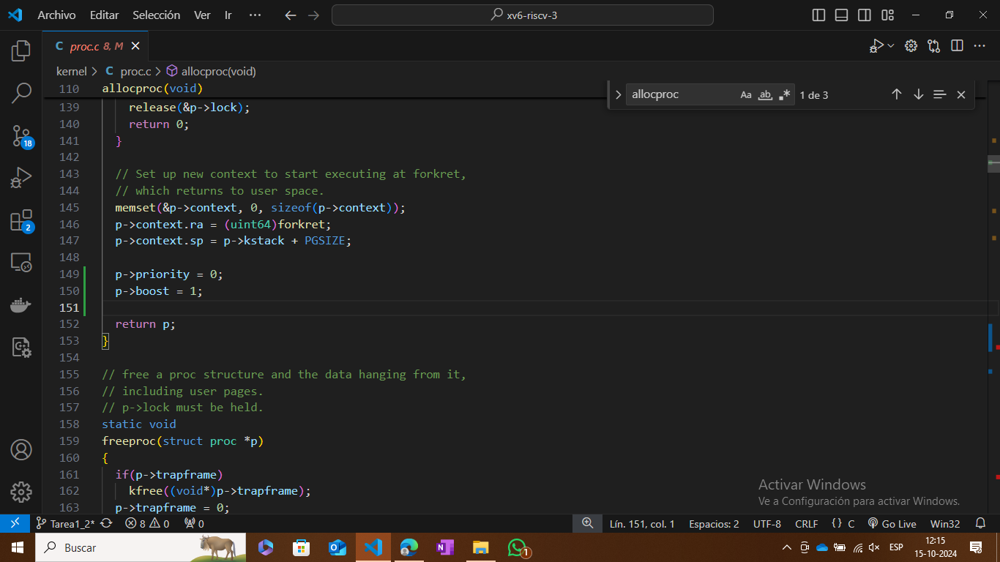
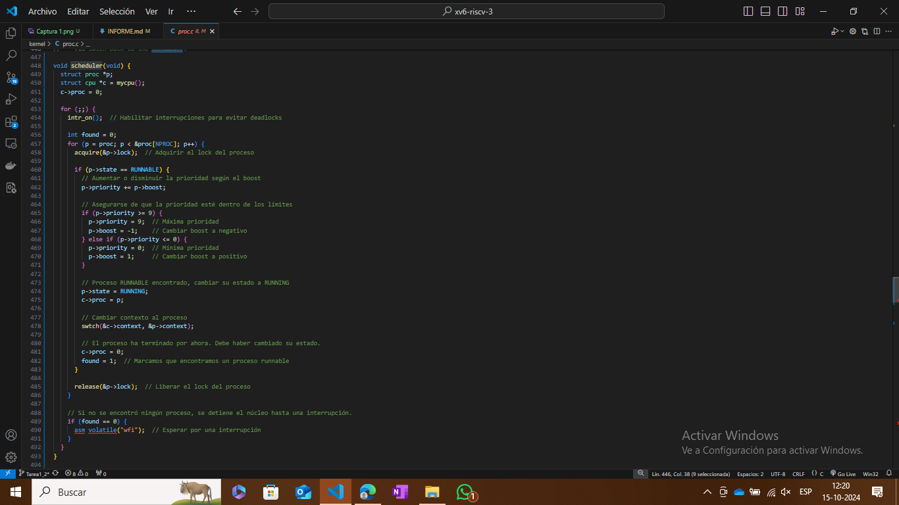
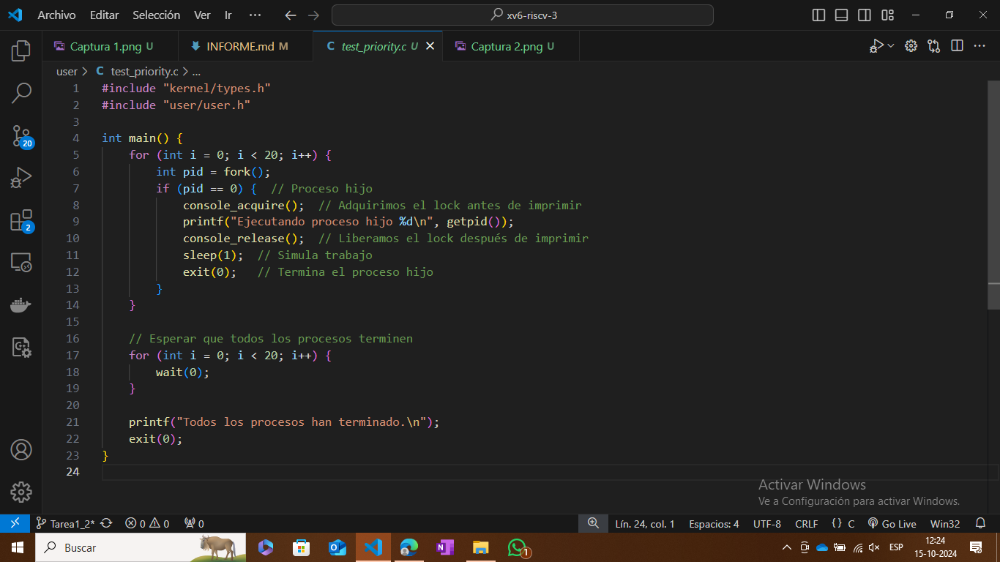
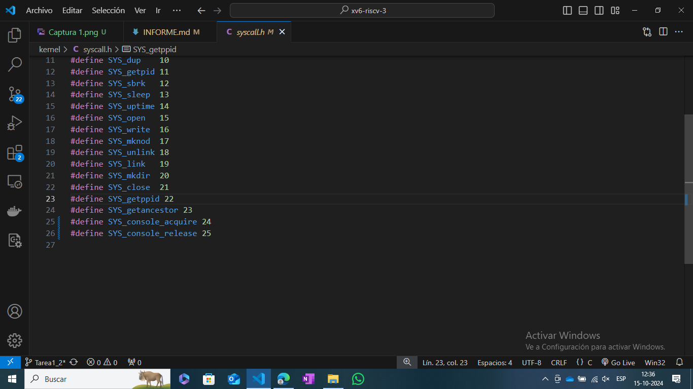
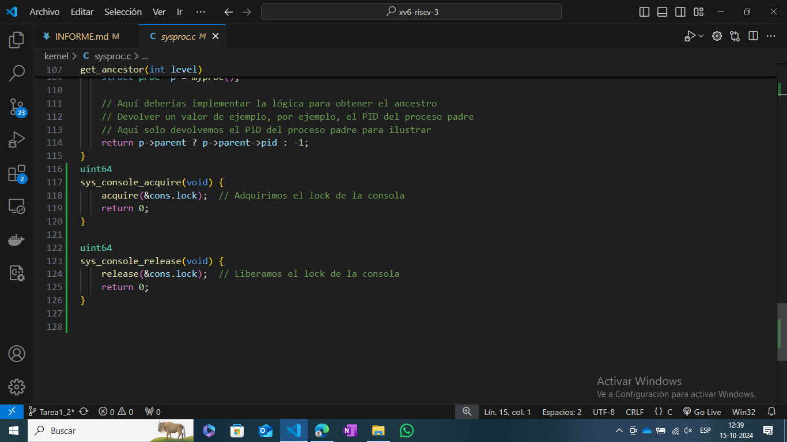
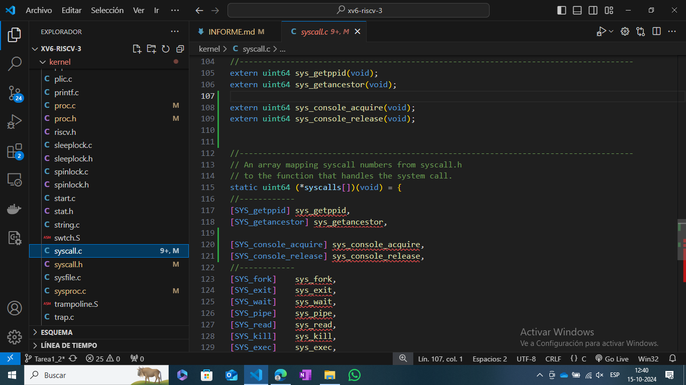
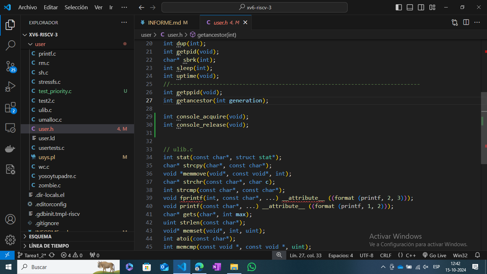
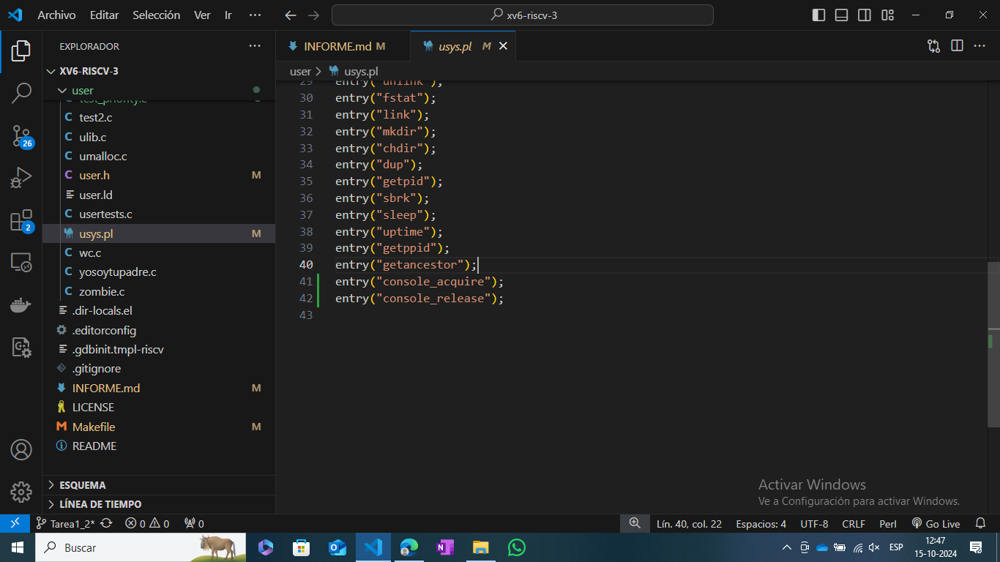
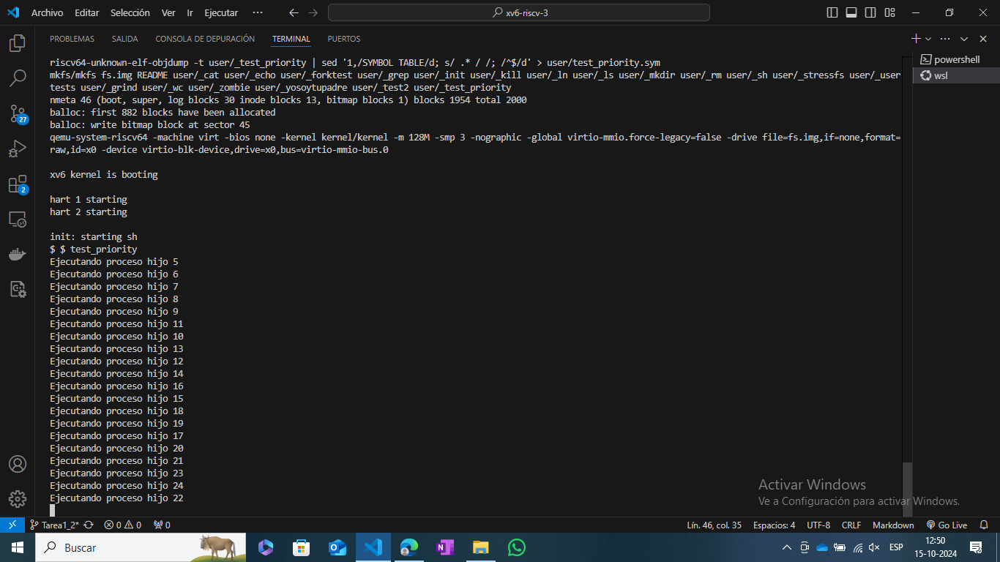

Para la tarea 2
Lo primero fué modificar la estructura de los rocesos agregando los nuevos campos "priority" y "boost" así poder modificar estos campos según sea nesesario para cada proceso por el scheduler

En segundo lugar se buscó modificar el funcionamiento de el scheduler para cumplir con los requisitos de la tarea y utilizar los nuevos campos de los porcesos.

El tercer paso fue crear un programa para pobar las nuevas funcionalidades del scheduler el programa se decidió llamar "test_priority.c" y en este se agregarion los requisitos requeridos, 20 procesos con un sleep para la visualisación. 

Se agregó el programa "test_priority" en el Makelife para la ejecución

Debido a la primera gran dificultad la cual consistía en una sobreposición de los printf en pantalla fué que se decidió agregar dos nuevas funciones para bloquear la consola. Apartando las pruebas de código en las que se buscó que el scheduler funcionace bien y el test_priority estuviece bien definido.

Estas nuevas funciones se decidió crearlas porque el user no tiene la facultad de plocear la consola directamente por lo que se requirió crear funciones que hicieran llamadas al kernel y poder bloquear la consola con el printf del test_priority.

El primero de estos pasos fue agregar estas funciones en syscall.h

Luego definir las funciones con las llamadas al bloque y desbloqueo de la consola.

A continuación las llamadas de ambas funciones se definen en syscall.c

Luego se agregan las funciones en user.h

Se agregaron estas nuevas funciones en tes_priority. Ya que la captura de test_priority que se muestra más arriva es de la última versión ya figuran estas funciones en la captura 4.

Se agregaron las funciones en usys.pl.

Por último la prueba de la nueva función.

Como ya se mencionó la mayor dificultad que se encontró fue debido a esta entrada en consola simultanea donde se imprimían varias lineas de texto superpuestas con caracteres mesclados, donde se perdía la legibilidad del texto. Gracias a la tarea anterior fue que no se complicó el crear una nueva función para dar más facultades al user como la de bloquear la consola.
