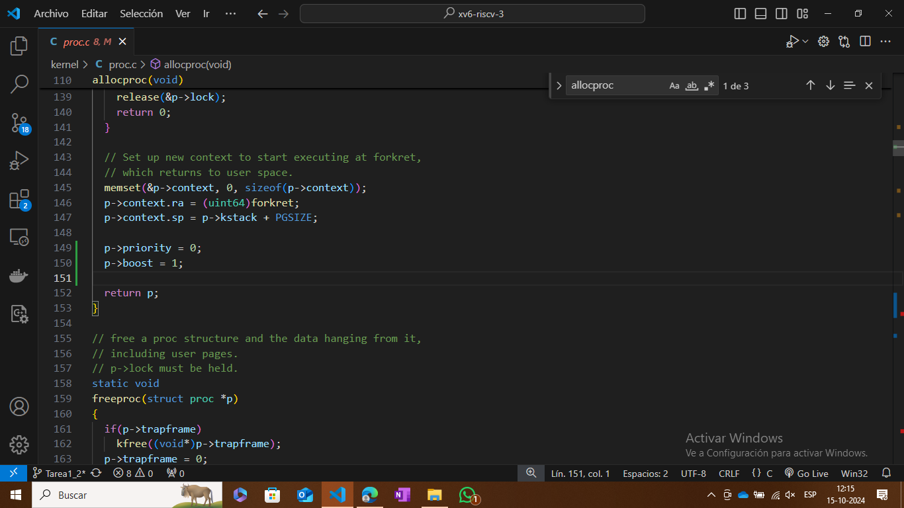
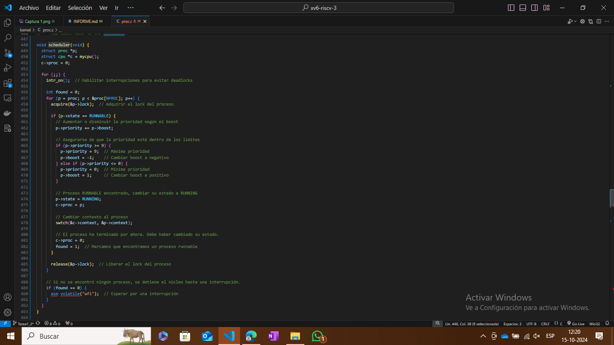
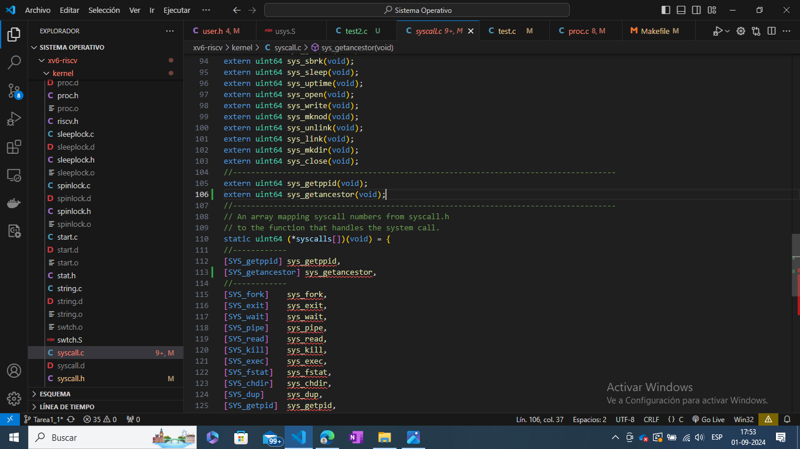
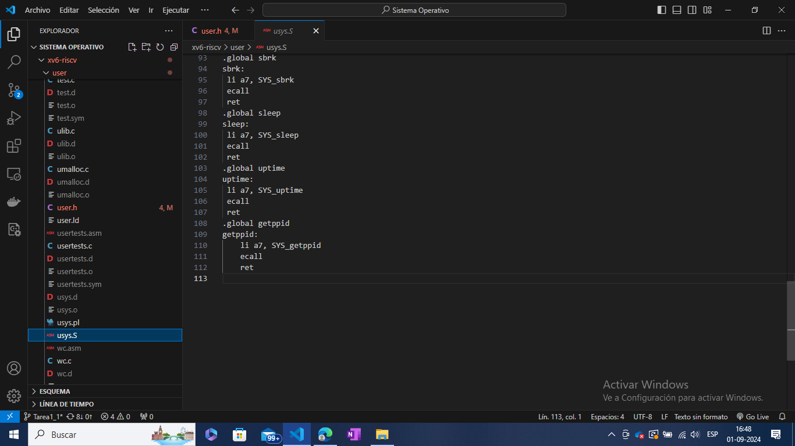
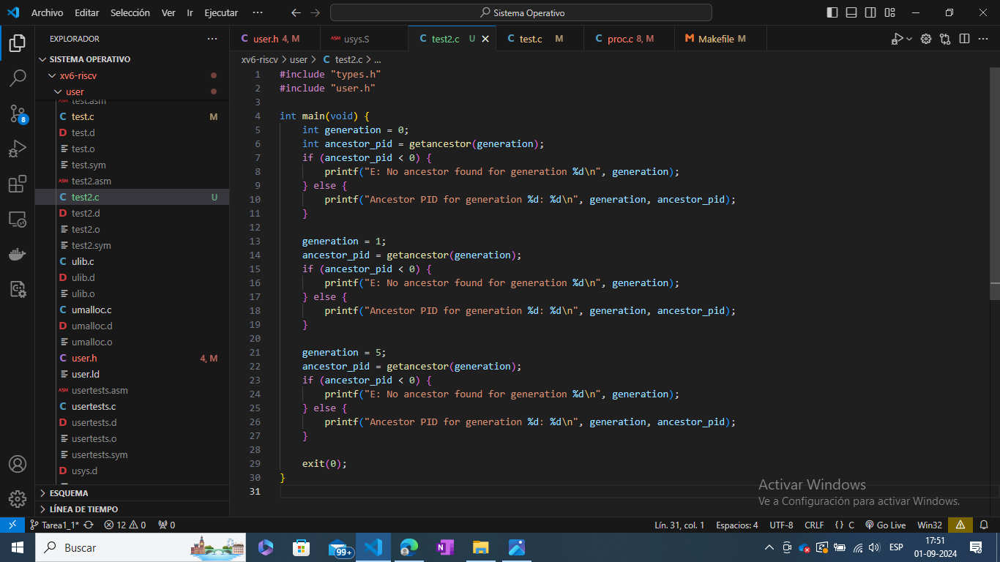
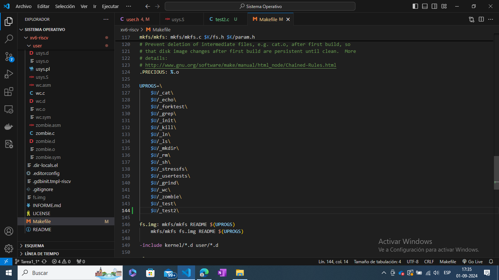
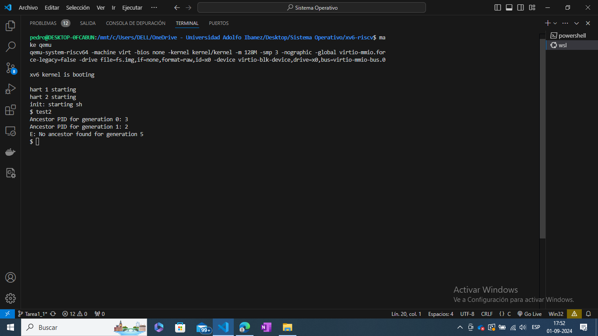

Para la tarea 1 Parte 2
Lo primero fué definir en syscall.h el número de la llamada de la nueva función "getancestor"

En segundo lugar, editar proc.c para agregar la función "sys_getancestor" la cual retorna el ID de la generacion "generation" anterior del proceso que la invoca ciendo 0 el proceso acual y devolviendo -1 si no hay más tantas generaciones anteriores.

En el tercer paso se editó el archivo syscall.c para agregar la nueva llamada al sistema.

Luego se buscó modificar el archivo user.h para declarar la nueva función.

En el cuarto paso se modificó el archivo usys.pl para añadir la llamada a Sistema. Notar que el archivo es el que se encarga de generar el archivo usy.S el cual es el que verdaderamente se debe modificar.

Por último se creo el archivo test.c en la carpeta user para probar la llamada con las generaciones 0, 1 y 5.

Como paso adicional para realizar el test se modifico el archivo Makefile para agregar el archivo test2.c

Prueba de la nueva función.

Dentro de las mayores dificultades fueron las de descubrir donde se realizaban las modificaciones y tambiar aberigur algunos archivos que eran auto generados lo que si no se realizaba un make clean no se apreciaba correctamente.
