Para la tarea 3
Lo primero fué agregar las nuevas funciones "mprotect" y "munprotect" en el archivo sysproc.c para posteriormente realizar las llamadas.

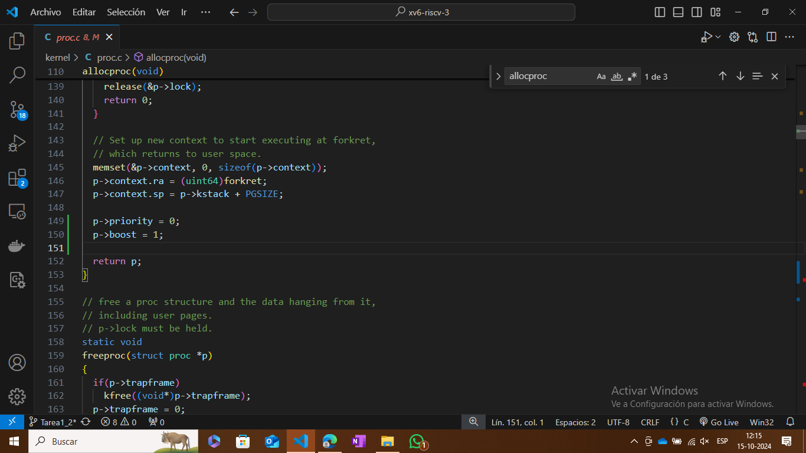
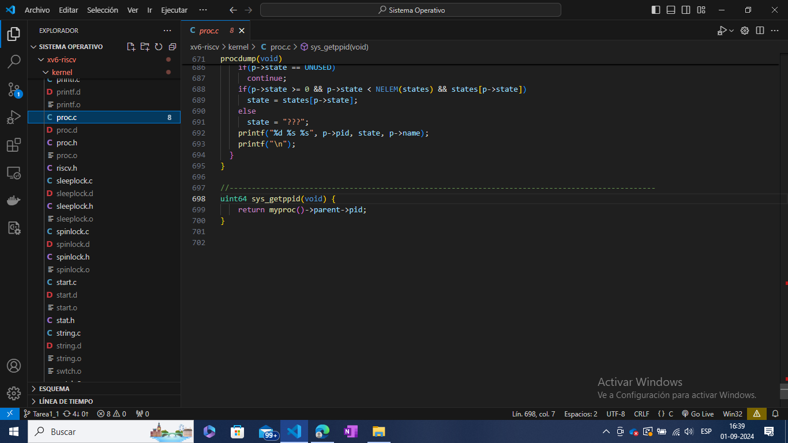
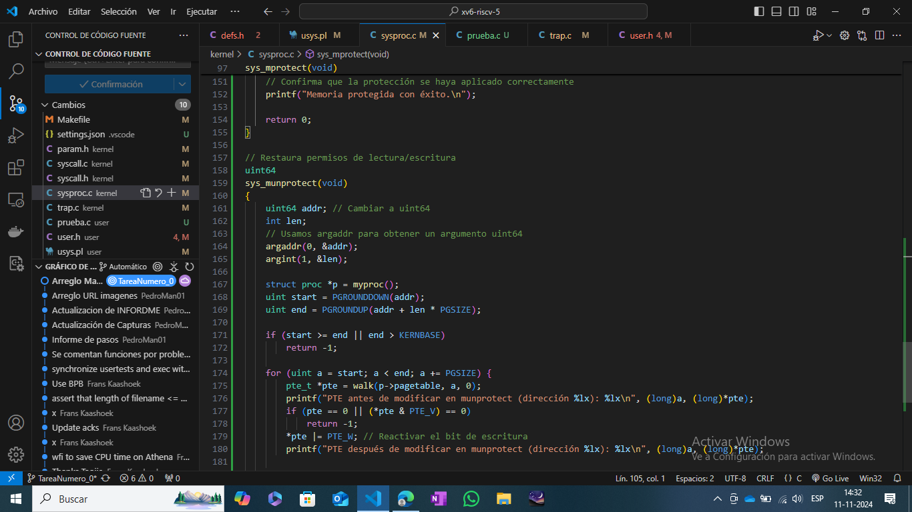
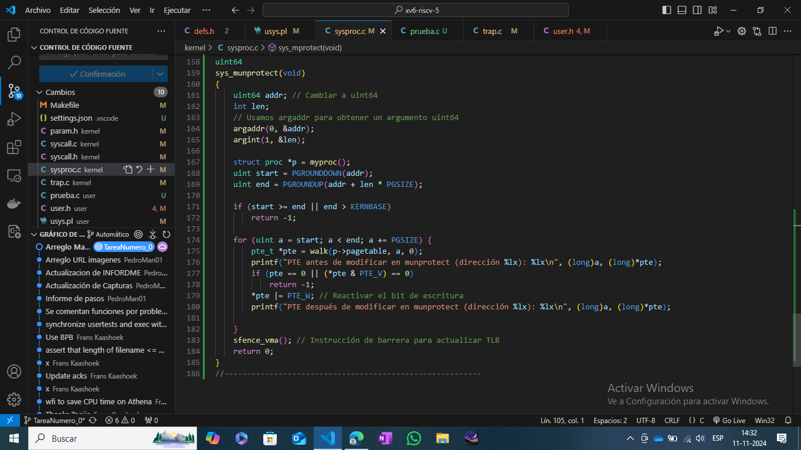

En segundo lugar se agregan las funciones en usys.pl que es un generador del archivo usys.S.

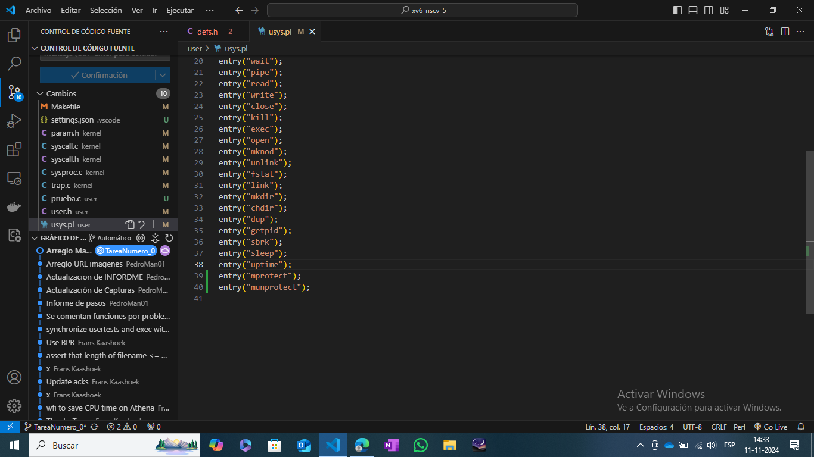

El tercer paso fue agregar las funciones como llamadas de sistema en el archivo user.h. 

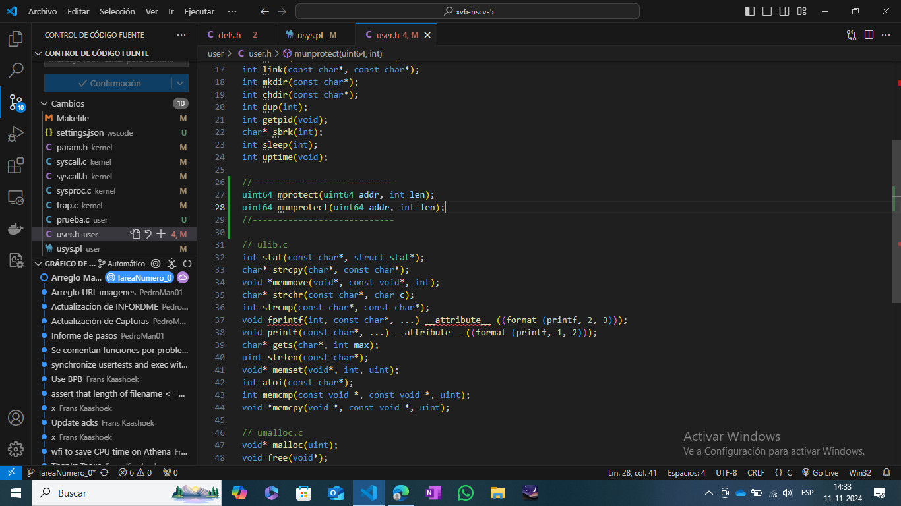

Se definieron los numeros de llamada a sistema en el archivo syscall.h

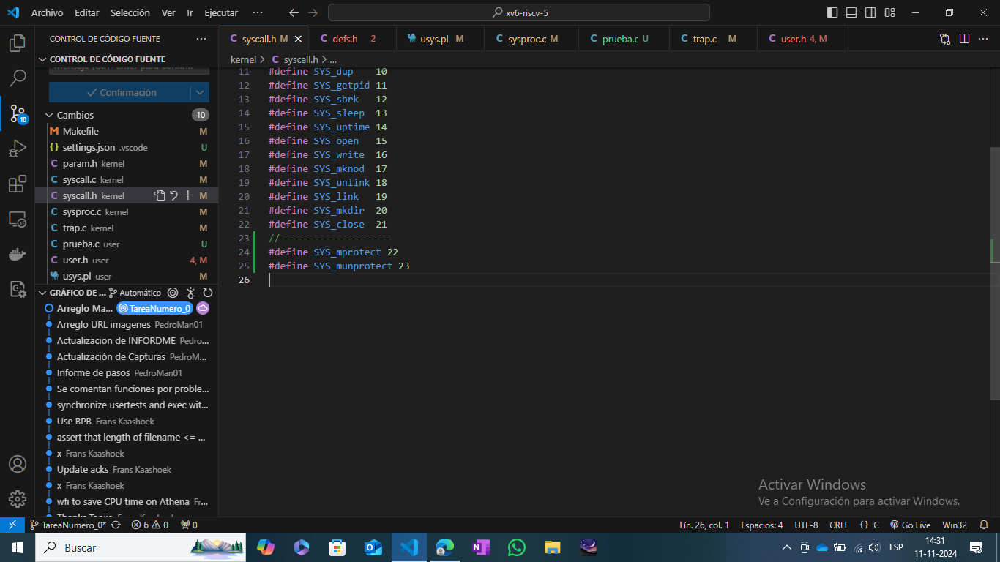

Se agregaron estas llamadas en el archivo syscall.c

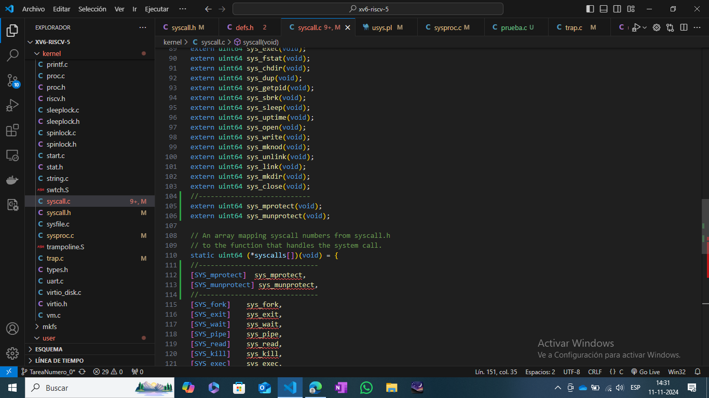

Luego de esto se definió el archivo "prueba.c" el cual va a ser el responsable de probar las nuevas funciones con una llamada de parte del usuario.

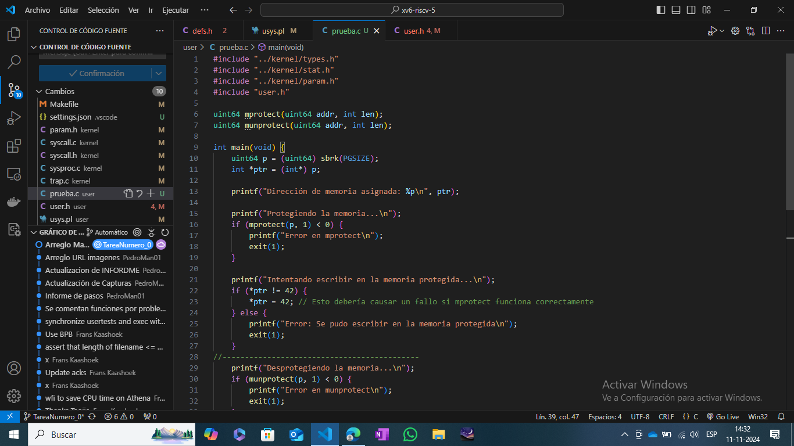
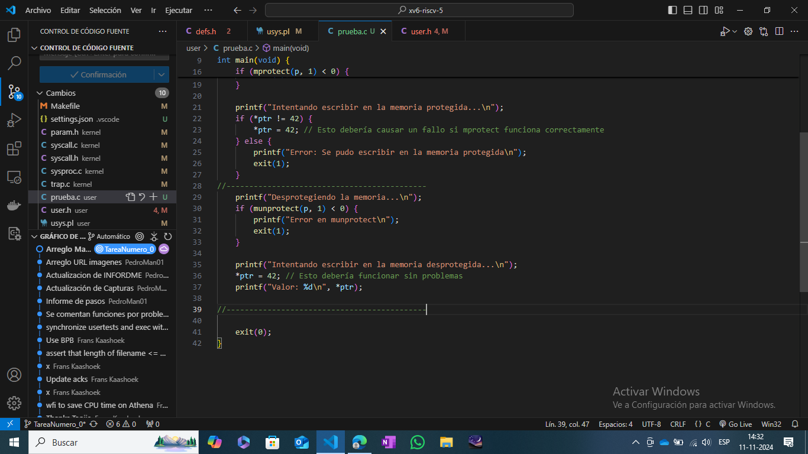

Por último, con respecto al archivo prueba.c se realiza la modificación en Makelife para que se reconosca la llamada de usuario de este programa.

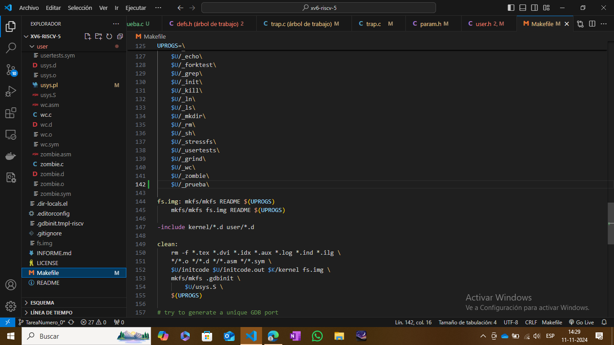

La primera de las dificultades que se encontaron fue que no se encontraba definido en el sistema el tamaño de una pagina por lo que se modifico el archivo param.h para agregar este parametro y utilizarlo en prueba.c

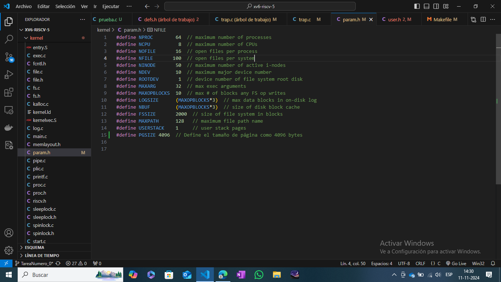

Una segunda dificultad que se encontró a la hora de probar el código, era que en el sistema al encontrar una excepción de intentar escribir en una pagina protegida este mataba el proceso por lo que se bucó modificar esta función para el el proceso no finalizara con la esepción.

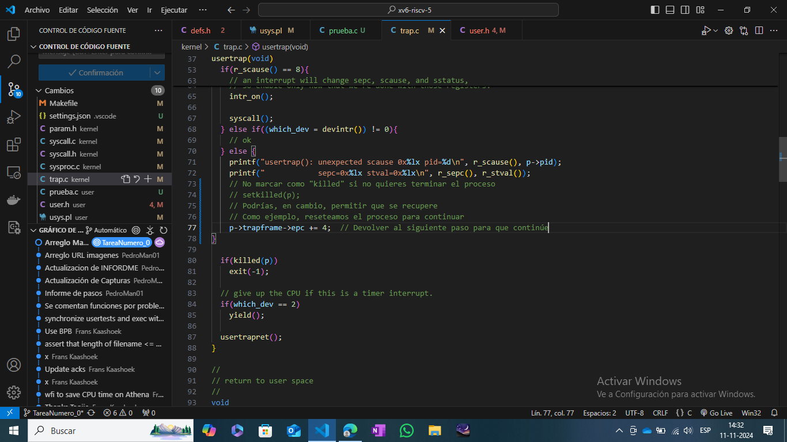

Por último la prueba de las nuevas función.

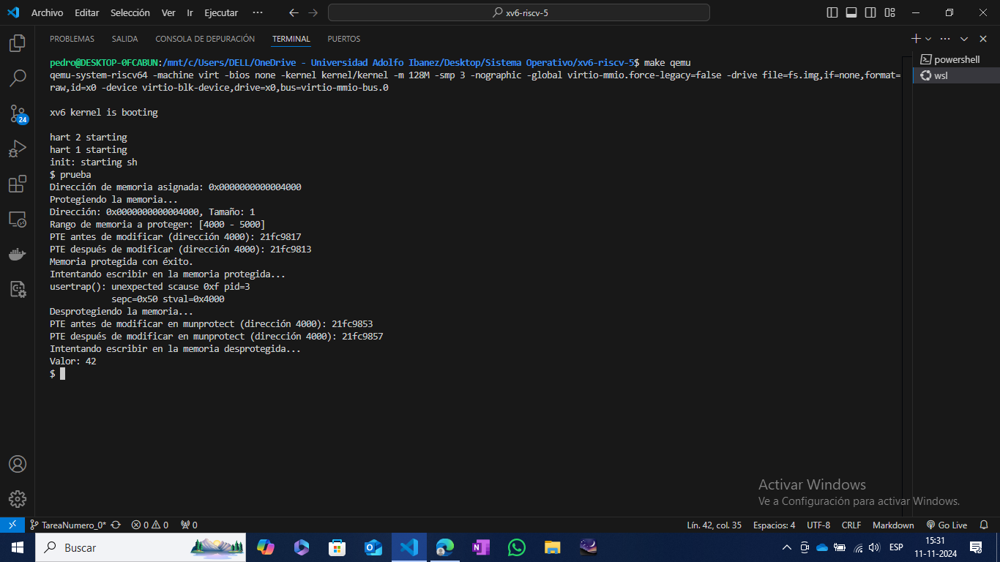