Para la tarea 4
Lo primero fué agregar la nueva llamada a sistema "chmod" en los diferentes archivos. 

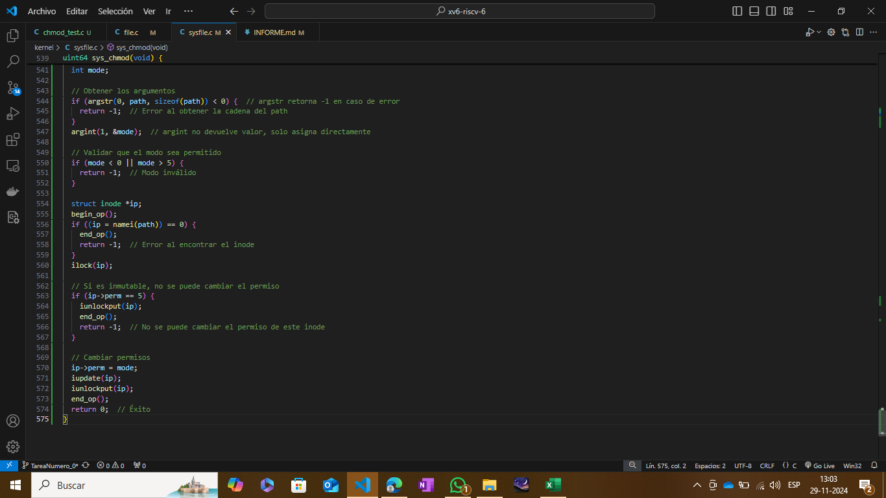

En segundo lugar se agrega la funcion en usys.pl que es un generador del archivo usys.S.

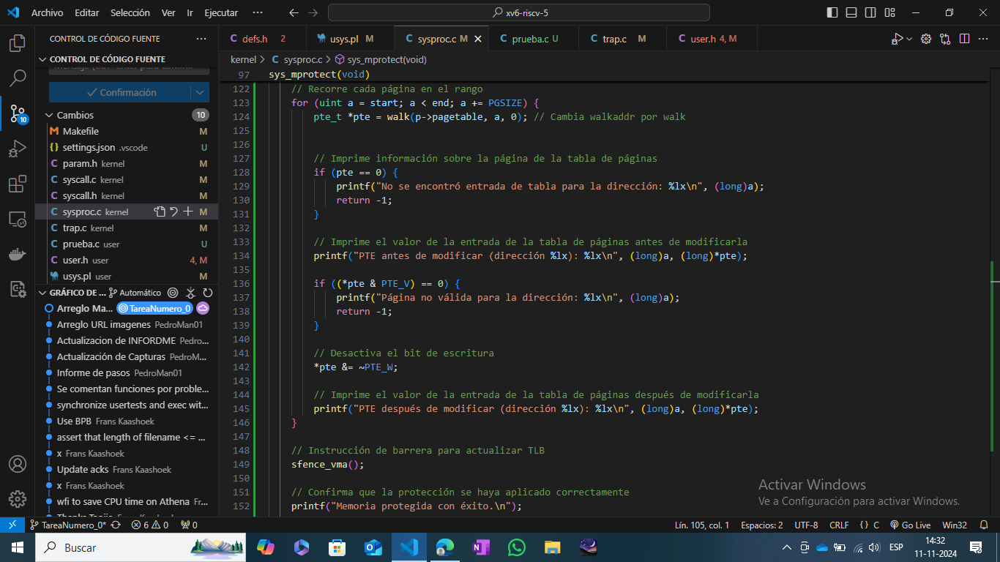

El tercer paso fue agregar la funcion como llamadas de sistema en el archivo user.h. 

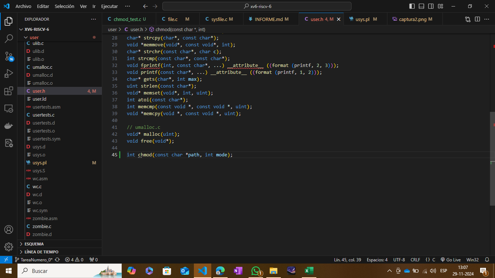

Se define el numero de llamada a sistema en el archivo syscall.h

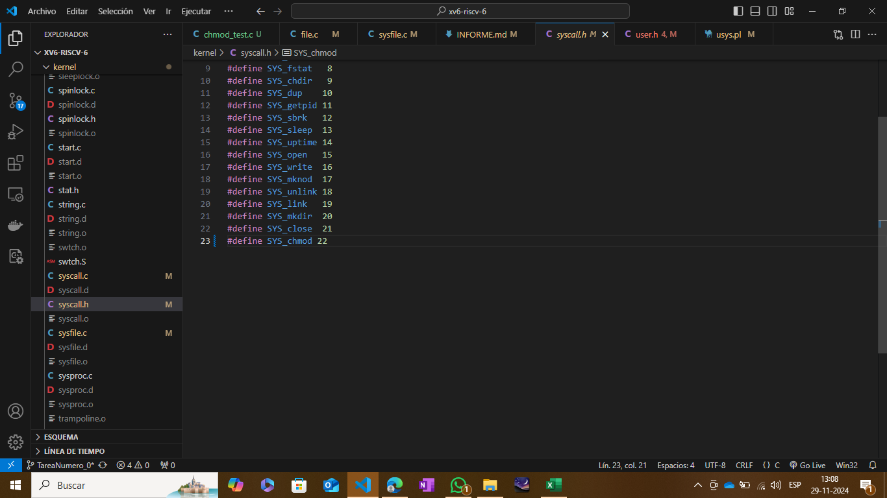

Se agregaró esta llamada en el archivo syscall.c

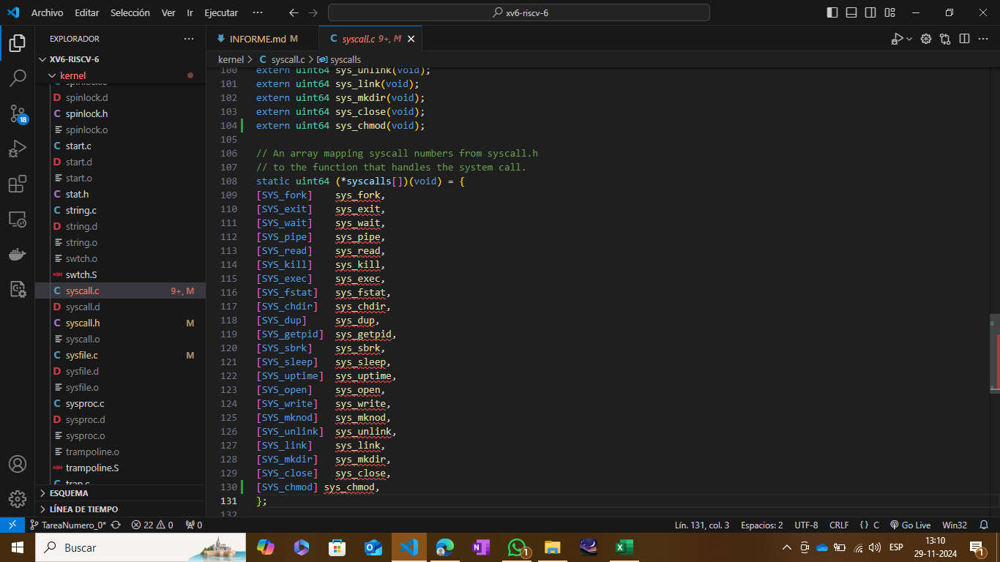

Luego de esto se definió el archivo "chmod_test.c" el cual va a ser el responsable de probar la nueva funcion con una llamada de parte del usuario.

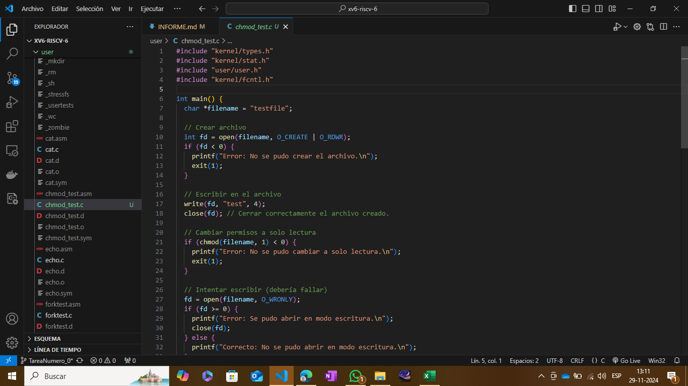
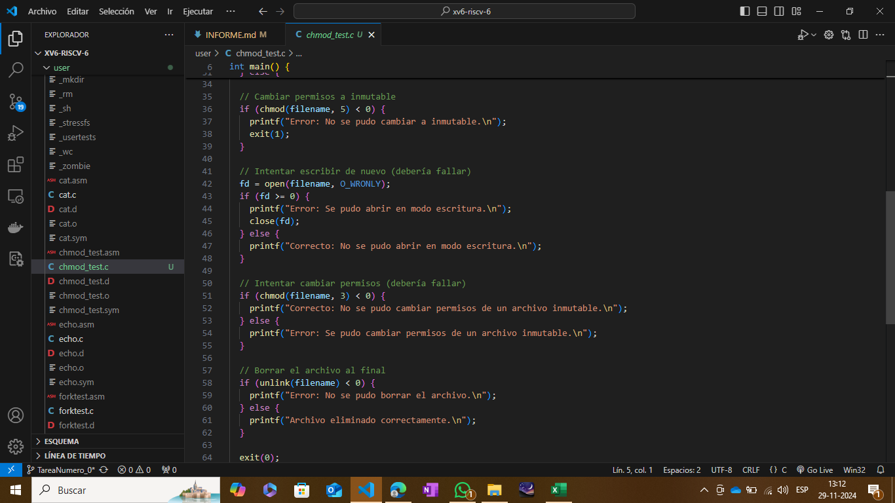

Por último, con respecto al archivo chmod_test.c se realiza la modificación en Makelife para que se reconosca la llamada de usuario de este programa.

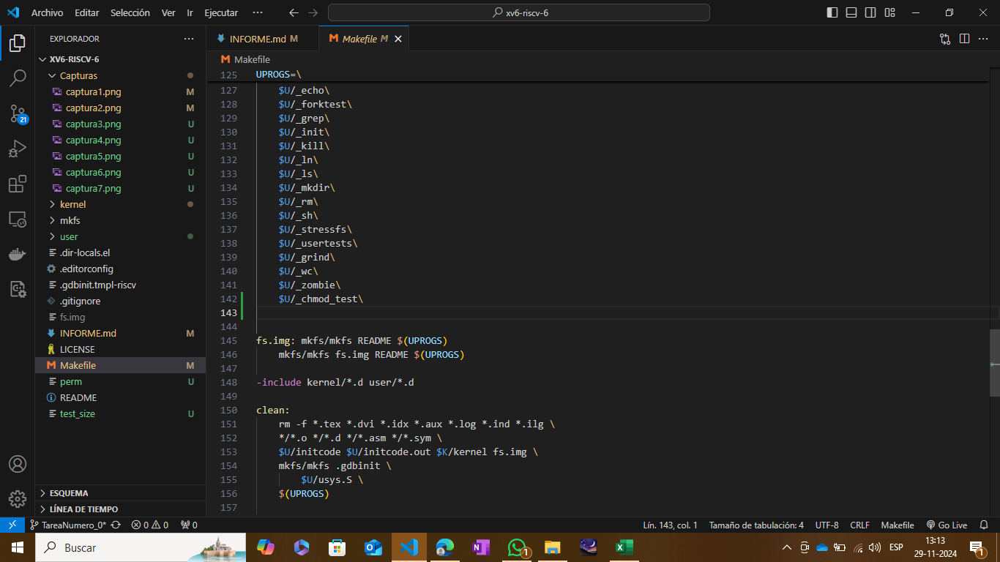

Dentro de las dificultades.

Se encontraron problemas a la hora de implementar la función por lo que se agregaron algunos print en las funcion "fileclose" para visualizar cual era el problema pero no tiene relevancia en la implemantación. 

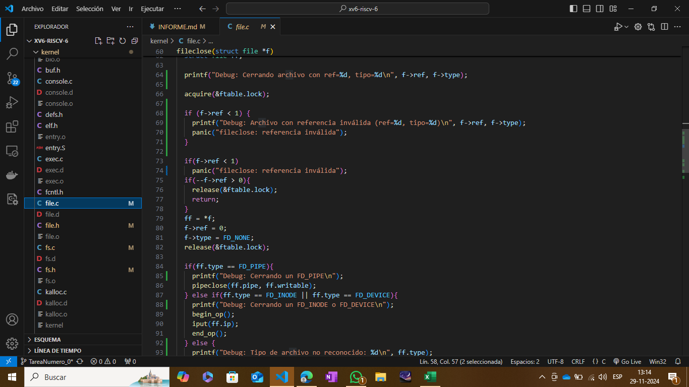

Una segunda dificultad fue a la hora de agregar un nuevo valor para la estructura de inode que permitiece manejar los permisos como se muetra a continuacion en la primera de las dos capturas de abajo. Ya que este nuevo valor llevó a una incompativilidad en la estructura de dinode de la memoria fisica ya que esta debía ser divisible por 1024 por lo que fue necesario agregar un valor extra "char pad[60]; // Padding to align size to 128 bytes"
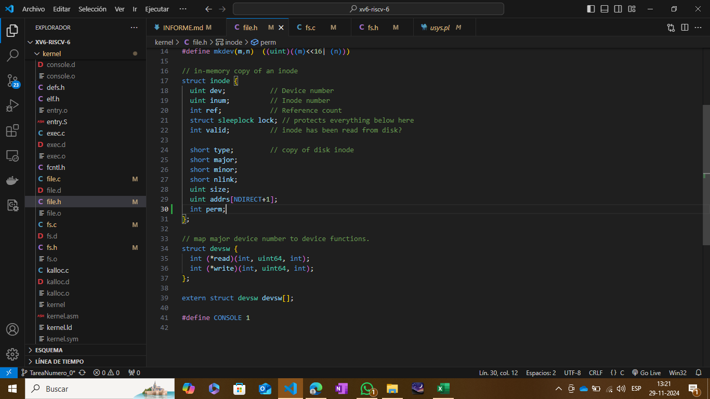
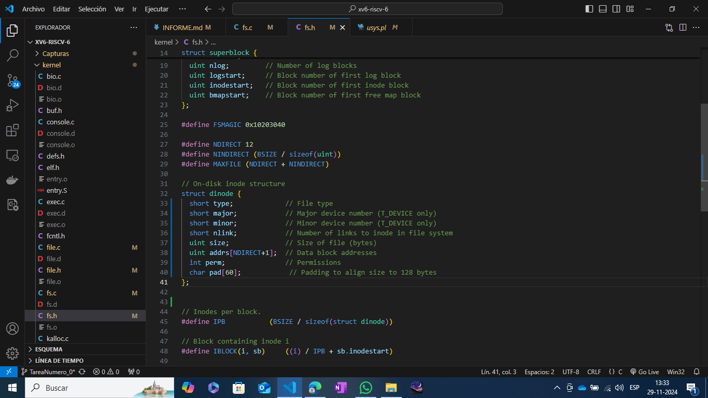

Por último la prueba de las nuevas función.

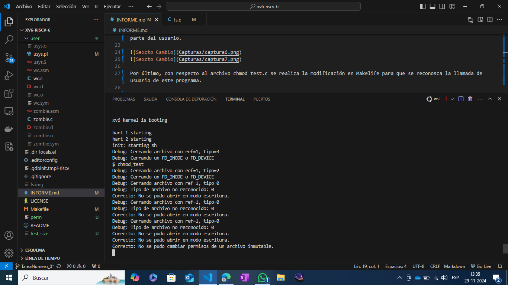