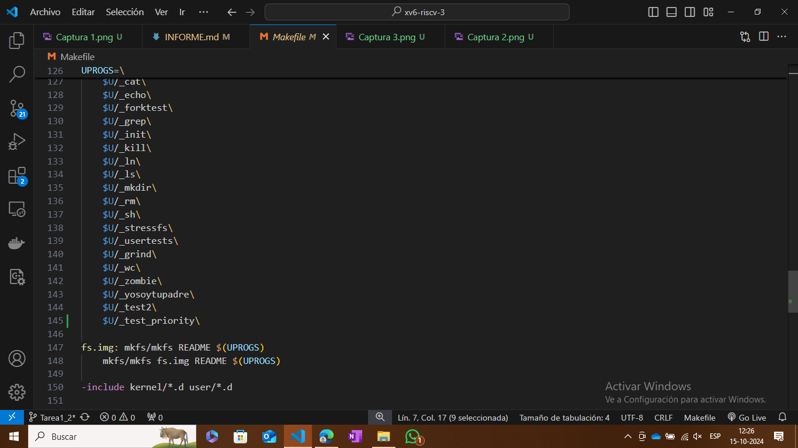

Para la tarea 1 Parte 1
Lo primero fué definir en syscall.h el número de la llamada de la nueva función "getppid"

En segundo lugar, editar proc.c para agregar la función "sys_getppid" la cual retorna el ID del proceso padre del proceso que la invoca.

En el tercer paso se editó el archivo syscall.c para agregar la nueva llamada al sistema.

Luego se buscó modificar el archivo user.h para declarar la nueva función.

En el cuarto paso se modificó el archivo usys.s para añadir la llamada a Sistema.

Por último se creo el archivo test.c en la carpeta user para probar la llamada.

Como paso adicional para realizar el test se modifico el archivo Makefile para agregar el archivo test.c

Prueba de la nueva función.

